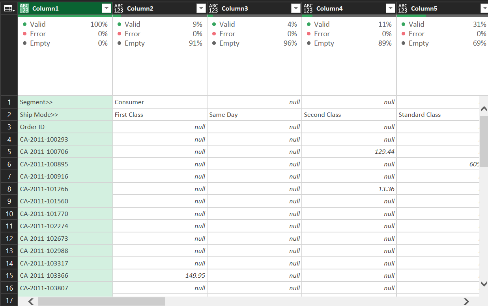

# Data Cleaning with Foresight BI using Excel and Power Query

## Introduction
Data cleaning is the process of fixing or removing incorrect, corrupted, incorrectly formatted, duplicate, or incomplete data within a dataset [(Tableau.com)](https://www.tableau.com/learn/articles/what-is-data-cleaning). According to [Career Foundary](https://careerfoundry.com/en/blog/data-analytics/what-is-data-cleaning/), data analysts spend around 60-80% of their time carrying out data cleaning activities. This is why I have felt it is important for me to undertake this project as a lot of the data we find online usually requires little to no cleaning.

Finding datasets to clean was not too difficult after a quick google search led me to [Foresight BI's dirty data samples](https://foresightbi.com.ng/microsoft-power-bi/dirty-data-samples-to-practice-on/#). 

In this repository, you will be reading about the steps I took in cleaning 6 of the 8 datasets provided in the Foresight BI website. You can find the excel sheets with both dirty data and my solutions [here](Cleaning_data_project.xlsx)

## Badly Structured Sales Datasets 1 & 3

### Badly Structured Sales Dataset 1

### Badly Structured Sales Dataset 3

The first 4 datasets have really similar structures with little differences between them so I would be walking through the first and third one since I pretty much used the same steps to clean the first and second data sets and the sames ones to clean the third and fourth datasets.

For the first dataset, I began by importing the data into Power Query.

The first thing I did was to get rid of all the subtotals and the grand total in the dataset to avoid double counting when analyzing. I did this by removing all columns with the totals for each segment and filtering out the rows where "Grand Total" was listed in the first column.

Removed subtotals | Removed Grand Total
------------------|--------------------
|

Now that all totals were gone, it was time to attempt getting the data into the desired format. For the dataset, ideally, I should be having 4 columns; 'Segment', 'Ship mode', 'Order ID' and 'Sales'. As you can see from the images above, the Order ID is in somewhat the right format but not quite, I needed it to be it's own seperate column. The Segment and Ship mode however are displayed as rows.

To fix this I transposed the data. Transposing is simply making all rows in a table columns and all columns rows which means for a dataset where I had 825 rows and 13 columns, I now had 13 rows and 825 columns as displayed below.

I then promoted the first row to column headers and filled down the 'Segment' column to replace all null values with the input above the cells.

2 columns down 823 more columns to go!

All I had to do was select the first two columns and unpivot all other columns. This put all columns in the data set with non-null values in one column (Attribute) and the values in those columns into another column (Value) as shown in the image below.

Now that I had all 4 columns in my dataset all that was left to do was change the header names and the 'Sales' data type to currency and 🎉. I had my first clean dataset.

In the third data set, the structure was pretty similar to the first one except this had two horizontal and two vertical headers

Again, the first thing I did was to get rid of the grand totals. The next step was the main difference between the first two datasets and the next two after them. I had to merge the first two columns using (;) as my delimiter because of the structure of the data. This helped me unpivot the data properly so I could get 5 different columns.

After merging columns 1 and 2, I went through the same steps took when cleaning the first dataset; transposing the data, promoting headers, filling down the 'Segment' column and unpivoting all other columns but the first two.

After unpivoting, I had to split the 'Attribute' column by the same (;) delimiter I merged the two columns with earlier.

Now that I had all 5 columns in the right order, all that was left was to rename the columns and assign the right data types to each column and just like that our first four sets of data were cleaned.

## Jumbled Customer Details Dataset 5 

Instructions 
> We see this one often when you download or copy something from the web. You should separate the different data categories into separate columns.
>

This dataset presented an entirely different problem than the first four had. All values were in one column with the column headers preceeding the actual values. In the image above, we can see that the clean data has 4 columns (Name, Address, Age and Gender). 

Again, the first thing I did was getting the data into PowerQuery.

Next, I started to seperate the data into different columns. To do this, I headed over to the "Add column" tab. In the tab, I selected "Custom Column" in the ribbon.

In the dialogue box that appears, I put in the name of the first column I was fixing, which in this case was "Name"

